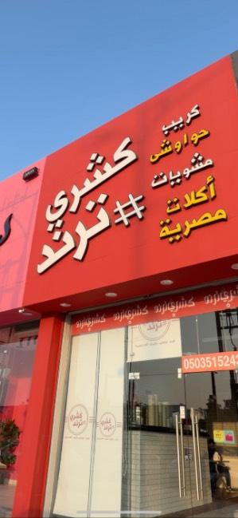

# Koshary Trend Menu

> Arabic-first, mobile-friendly restaurant menu with category filtering, search, and WhatsApp ordering.



## Overview
Koshary Trend is a production-ready, bilingual (Arabic/English) menu website built for a real restaurant. It focuses on fast browsing, clean categorization, and a smooth ordering flow that sends the cart to WhatsApp.

## Key Features
- Arabic-first, RTL layout with responsive design
- Category filters and instant search
- Cart with pickup/delivery option and WhatsApp order export
- PWA-ready with service worker and manifest
- Clear, product-focused visual layout

## Tech Stack
- HTML5, CSS3
- Bootstrap (bundled locally)
- Vanilla JavaScript
- Font Awesome + Google Fonts (Cairo)

## Project Structure
```
.
├── index.html
├── css/
│   ├── bootstrap.min.css
│   └── style.css
├── js/
│   ├── bootstrap.bundle.min.js
│   └── index.js
├── images/
├── manifest.json
├── sw.js
└── _headers
```

## Run Locally
Option 1 (simple):
- Open `index.html` in your browser.

Option 2 (recommended for service worker):
- Serve with any static server (example):
```
python3 -m http.server 8080
```
- Then visit `http://localhost:8080`

## Customize the Menu
- Menu items live in `js/index.js` under `menuData`.
- Categories are defined in `index.html` under `#categoryFilters`.

## Production Notes
- This project is already live and used in production.
- The structure is intentionally simple for fast updates.

## License
All rights reserved. This project is proprietary and intended for Koshary Trend.
